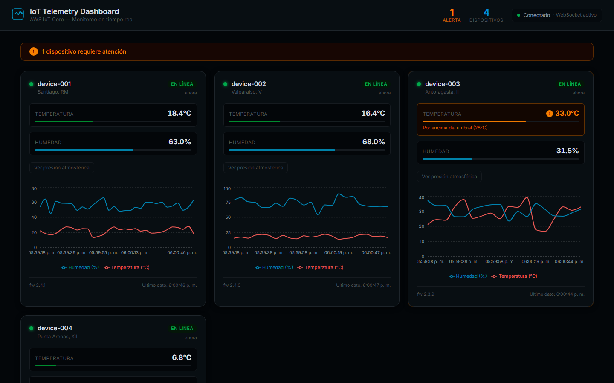
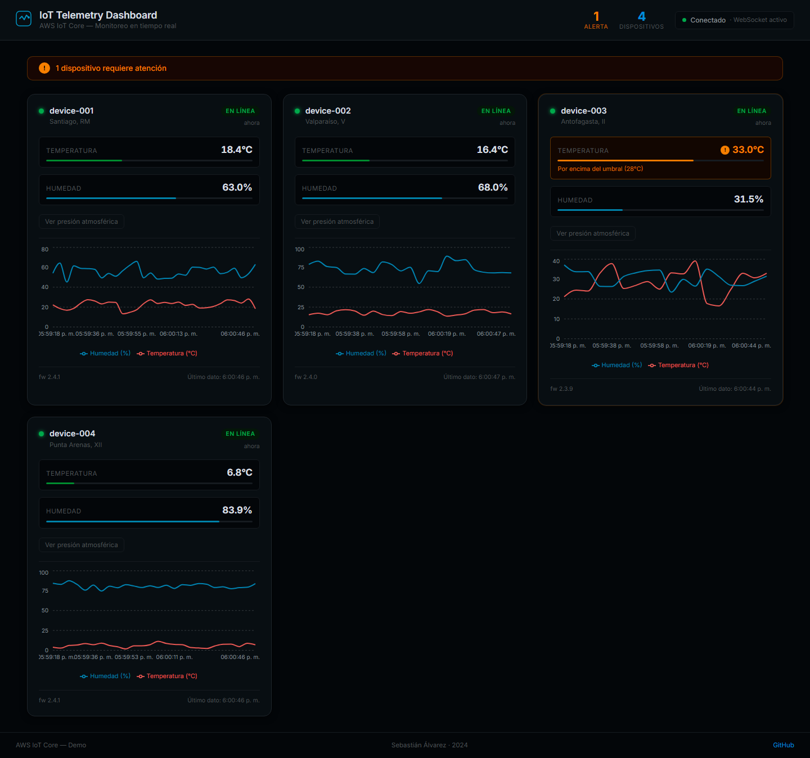

# AWS IoT Telemetry Dashboard

Dashboard de telemetría IoT en tiempo real que demuestra integración completa con **AWS IoT Core**: Things, certificados X.509, protocolo MQTT y streaming de datos a una interfaz React via WebSocket.

Corre en modo local (sin cuenta AWS) usando un broker MQTT embebido (Aedes), y tiene soporte directo para conectarse a AWS IoT Core con un switch de configuración.

---

## Capturas de pantalla

| Dashboard en vivo (4 dispositivos, gráficos en tiempo real) |
|--------------------------------------------------------------|
|  |



---

## Arquitectura

```
┌─────────────────────────────────────────────────────────────────┐
│                         MODO LOCAL                              │
│                                                                 │
│  ┌──────────────┐     MQTT      ┌────────────────────────────┐  │
│  │  Simulador   │  (port 1883)  │        Broker / Backend    │  │
│  │  (Node.js)   │──────────────▶│  Aedes MQTT broker         │  │
│  │              │               │  + MQTT subscriber         │  │
│  │  4 devices   │               │  + Device store (memoria)  │  │
│  │  JSON every  │               │  + Socket.IO server        │  │
│  │  3-5 segundos│               └──────────────┬─────────────┘  │
│  └──────────────┘                              │ WebSocket       │
│                                               ▼                 │
│                                    ┌────────────────────┐       │
│                                    │  React Dashboard   │       │
│                                    │  (Vite + TS)       │       │
│                                    │  Charts (Recharts) │       │
│                                    │  Alertas en tiempo │       │
│                                    │  real              │       │
│                                    └────────────────────┘       │
└─────────────────────────────────────────────────────────────────┘

┌─────────────────────────────────────────────────────────────────┐
│                        MODO AWS                                 │
│                                                                 │
│  ┌──────────────┐   MQTT over    ┌────────────────────────────┐ │
│  │  Simulador   │   TLS (8883)   │     AWS IoT Core           │ │
│  │  o device    │───────────────▶│                            │ │
│  │  real        │  cert + key    │  Thing Registry            │ │
│  └──────────────┘  + Root CA     │  X.509 Certificates        │ │
│                                  │  IoT Policies              │ │
│                                  │  MQTT Topics               │ │
│                                  └──────────┬─────────────────┘ │
│                                             │ MQTT over TLS     │
│                                             ▼                   │
│                                  ┌────────────────────────────┐ │
│                                  │  Backend (mismo código)    │ │
│                                  │  se suscribe al endpoint   │ │
│                                  │  de AWS IoT Core           │ │
│                                  └──────────┬─────────────────┘ │
│                                             │ WebSocket         │
│                                             ▼                   │
│                                  ┌────────────────────────────┐ │
│                                  │  React Dashboard           │ │
│                                  └────────────────────────────┘ │
└─────────────────────────────────────────────────────────────────┘
```

**Topics MQTT:** `devices/{deviceId}/telemetry`

**Payload JSON:**
```json
{
  "deviceId": "device-001",
  "timestamp": 1700000000000,
  "temperature": 24.5,
  "humidity": 65.2,
  "pressure": 1013.5,
  "status": "online",
  "location": "Santiago, RM",
  "firmwareVersion": "2.4.1"
}
```

---

## Stack tecnológico

| Componente | Tecnología |
|---|---|
| Simulador | Node.js + TypeScript, `mqtt` npm package |
| Broker local | Aedes (MQTT broker embebido en Node.js) |
| Backend | Node.js + TypeScript, Express, Socket.IO |
| Frontend | React 18 + Vite + TypeScript |
| Gráficos | Recharts |
| Conexión AWS | `mqtt` con `mqtts://` + certificados X.509 |

---

## Estructura del proyecto

```
aws-iot-dashboard/
├── broker/                  # Backend: Aedes broker + WebSocket bridge
│   ├── src/
│   │   ├── index.ts         # Entry point
│   │   ├── config.ts        # LOCAL vs AWS config via env vars
│   │   ├── localBroker.ts   # Servidor Aedes embebido
│   │   ├── mqttSubscriber.ts# Suscripción a topics de telemetría
│   │   ├── deviceStore.ts   # Estado en memoria de todos los dispositivos
│   │   ├── wsServer.ts      # Express + Socket.IO + REST API
│   │   └── types.ts         # Tipos TypeScript compartidos
│   └── package.json
│
├── simulator/               # Simulador de dispositivos IoT
│   ├── src/
│   │   ├── index.ts         # Conecta y publica via MQTT
│   │   ├── devices.ts       # Perfiles de los 4 dispositivos simulados
│   │   └── generator.ts     # Genera valores realistas con ruido gaussiano
│   └── package.json
│
├── frontend/                # Dashboard React
│   ├── src/
│   │   ├── App.tsx          # Componente raíz
│   │   ├── hooks/
│   │   │   └── useSocket.ts # Hook de Socket.IO
│   │   ├── components/
│   │   │   ├── Header.tsx
│   │   │   ├── DeviceCard.tsx
│   │   │   ├── TelemetryChart.tsx
│   │   │   ├── MetricRow.tsx
│   │   │   ├── ConnectionBadge.tsx
│   │   │   └── EmptyState.tsx
│   │   ├── types/
│   │   │   └── telemetry.ts
│   │   └── utils/
│   │       └── format.ts
│   └── package.json
│
├── certs/                   # Certificados AWS (en .gitignore, NO commitear)
│   └── README.md            # Instrucciones para obtener los certs
│
├── .env.example             # Variables de entorno con documentación
├── .gitignore
└── README.md
```

---

## Cómo correr (modo local)

### Requisitos previos

- Node.js 18+ (probado con v24)
- npm 9+
- No se necesita cuenta AWS

### 1. Clonar e instalar dependencias

```bash
git clone https://github.com/sebalvarez/aws-iot-dashboard.git
cd aws-iot-dashboard

# Instalar dependencias de cada componente
cd broker && npm install && cd ..
cd simulator && npm install && cd ..
cd frontend && npm install && cd ..
```

### 2. Configurar entorno (opcional)

```bash
# Las variables tienen defaults razonables, pero puedes personalizarlas
cp .env.example .env
```

Variables relevantes para modo local:

```bash
IOT_MODE=local     # ya es el default
MQTT_PORT=1883     # ya es el default
WS_PORT=4000       # ya es el default
```

### 3. Iniciar el broker (terminal 1)

```bash
cd broker
npm run dev         # usa ts-node (desarrollo)
# o
npm run build && npm start   # compila y ejecuta
```

Deberías ver:
```
=== AWS IoT Telemetry Dashboard - Broker ===
Mode: LOCAL
MQTT port: 1883
WebSocket port: 4000
...
[Broker] Local MQTT broker running on port 1883
[WS] HTTP + Socket.IO server running on port 4000
[MQTT] Connected. Subscribing to devices/+/telemetry
```

### 4. Iniciar el simulador (terminal 2)

```bash
cd simulator
npm run dev
```

Deberías ver los 4 dispositivos publicando:
```
[device-001] OK | Temp: 22.3°C | Hum: 55.1% | Pressure: 1013.2hPa
[device-002] WARN | Temp: 28.9°C | Hum: 87.4% | Pressure: 1015.6hPa
```

### 5. Iniciar el frontend (terminal 3)

```bash
cd frontend
npm run dev
```

Abre [http://localhost:5173](http://localhost:5173) en tu navegador.

### Verificar que funciona

```bash
# API REST para confirmar que llegan datos
curl http://localhost:4000/api/devices
curl http://localhost:4000/api/health
```

---

## Conectar a AWS IoT Core real

Esta sección explica cómo conectar el dashboard a AWS IoT Core real, reemplazando el broker Aedes local por el endpoint de AWS.

### Paso 1: Crear un Thing en AWS IoT Core

```bash
# Crear el Thing
aws iot create-thing --thing-name "iot-dashboard-device"

# Crear certificado y activarlo (guardar los archivos que genera)
aws iot create-keys-and-certificate \
  --set-as-active \
  --certificate-pem-outfile certs/device-cert.pem \
  --public-key-outfile certs/public-key.pem \
  --private-key-outfile certs/private-key.pem

# Anotar el certificateArn del output anterior
```

### Paso 2: Crear y adjuntar una Policy

```bash
# Crear policy
aws iot create-policy \
  --policy-name "iot-dashboard-policy" \
  --policy-document '{
    "Version": "2012-10-17",
    "Statement": [{
      "Effect": "Allow",
      "Action": ["iot:Connect", "iot:Subscribe", "iot:Receive", "iot:Publish"],
      "Resource": "arn:aws:iot:*:*:*"
    }]
  }'

# Adjuntar policy al certificado (reemplaza CERTIFICATE_ARN)
aws iot attach-policy \
  --policy-name "iot-dashboard-policy" \
  --target CERTIFICATE_ARN

# Adjuntar certificado al Thing
aws iot attach-thing-principal \
  --thing-name "iot-dashboard-device" \
  --principal CERTIFICATE_ARN
```

### Paso 3: Obtener el endpoint de AWS IoT Core

```bash
aws iot describe-endpoint --endpoint-type iot:Data-ATS
# Output: { "endpointAddress": "abc123def456gh-ats.iot.us-east-1.amazonaws.com" }
```

### Paso 4: Descargar el Root CA

```bash
curl -o certs/AmazonRootCA1.pem \
  https://www.amazontrust.com/repository/AmazonRootCA1.pem
```

### Paso 5: Configurar variables de entorno

Crea un archivo `.env` en la raíz del proyecto:

```bash
IOT_MODE=aws
AWS_IOT_ENDPOINT=abc123def456gh-ats.iot.us-east-1.amazonaws.com
CERTS_DIR=./certs
WS_PORT=4000
```

### Paso 6: Iniciar en modo AWS

```bash
# El broker se conectará a AWS IoT Core en lugar de Aedes
cd broker && npm run dev

# El simulador también publicará a AWS IoT Core
cd simulator && npm run dev

# El frontend no cambia
cd frontend && npm run dev
```

### Notas sobre AWS IoT Core

- **Puerto:** AWS IoT Core usa MQTT over TLS en el puerto **8883** (MQTTS)
- **ClientId:** Debe ser único por conexión; si usas la misma policy para múltiples clientes, cada uno necesita un ID distinto
- **Topics:** AWS IoT Core distingue mayúsculas/minúsculas en los topics
- **QoS:** AWS IoT Core soporta QoS 0 y QoS 1 (no QoS 2)
- **Tamaño de mensaje:** Límite de 128KB por mensaje MQTT
- **Costo:** AWS IoT Core cobra por mensaje y por minuto de conexión; este demo tiene costo mínimo en el free tier

### IoT Rules (opcional)

Para persistir los datos, puedes crear una IoT Rule que envíe los mensajes a DynamoDB, S3, o Lambda:

```sql
-- SQL de ejemplo para una Rule
SELECT * FROM 'devices/+/telemetry'
WHERE temperature > 30
```

---

## Dispositivos simulados

| ID | Nombre | Ubicación | Intervalo | Umbral advertencia |
|---|---|---|---|---|
| device-001 | Sensor Santiago Centro | Santiago, RM | 3s | 28°C |
| device-002 | Sensor Valparaíso Puerto | Valparaíso, V | 4s | 26°C |
| device-003 | Sensor Antofagasta Desierto | Antofagasta, II | 5s | 35°C |
| device-004 | Sensor Punta Arenas Sur | Punta Arenas, XII | 3.5s | 15°C |

Los valores se generan con **ruido gaussiano** superpuesto a una **onda sinusoidal** que simula el ciclo día/noche, produciendo lecturas realistas con variación natural.

---

## Features del dashboard

- Tarjetas por dispositivo con status en tiempo real
- Gráficos de temperatura y humedad (últimos 40 puntos)
- Alertas visuales cuando temperatura o humedad cruza un umbral
- Toggle para ver presión atmosférica
- Badge de estado de conexión WebSocket
- Empty states mientras no hay dispositivos o conexión
- Diseño responsive

---

## Limitaciones y próximos pasos

| Limitación | Solución sugerida |
|---|---|
| Estado en memoria (se pierde al reiniciar) | Agregar Redis o DynamoDB como store |
| Sin autenticación en el WebSocket | Agregar JWT o session tokens |
| Un solo backend instance | Agregar load balancing + Redis pub/sub |
| Simulador publica todos los devices desde un solo cliente MQTT | Crear un proceso por device para mayor realismo |
| Sin persistencia de histórico | AWS Timestream o InfluxDB para series temporales |
| Sin alertas por email/SMS | Integrar AWS SNS con IoT Rules |

---

## Autor

**Sebastián Álvarez** — Full Stack Developer  
[GitHub](https://github.com/sebalvarez) · [LinkedIn](https://linkedin.com/in/sebalvarez)

---

## Licencia

MIT
